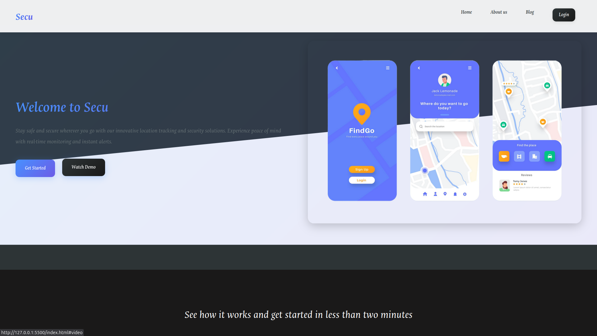
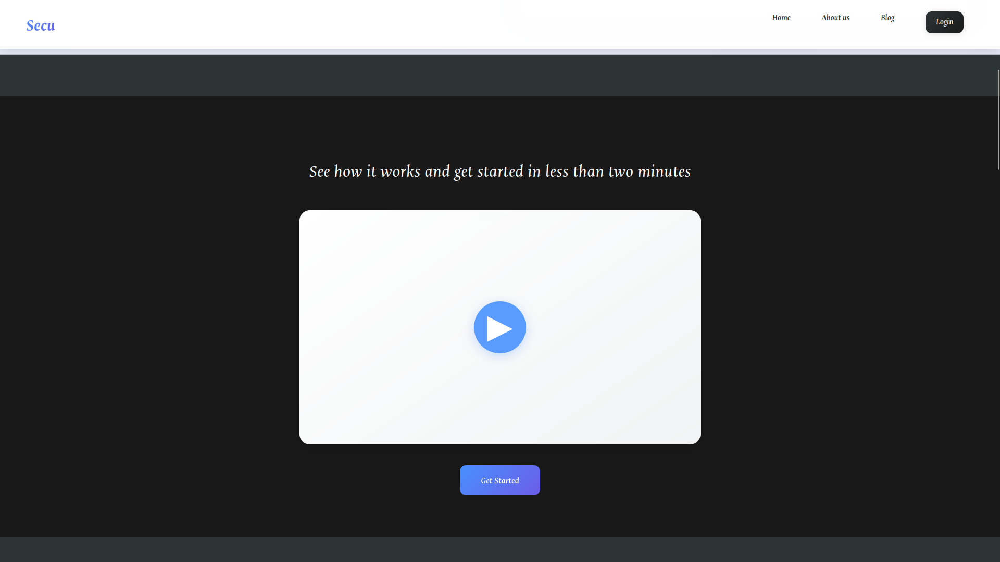
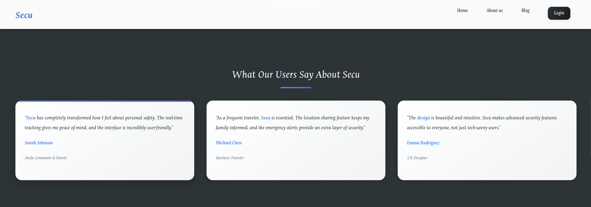
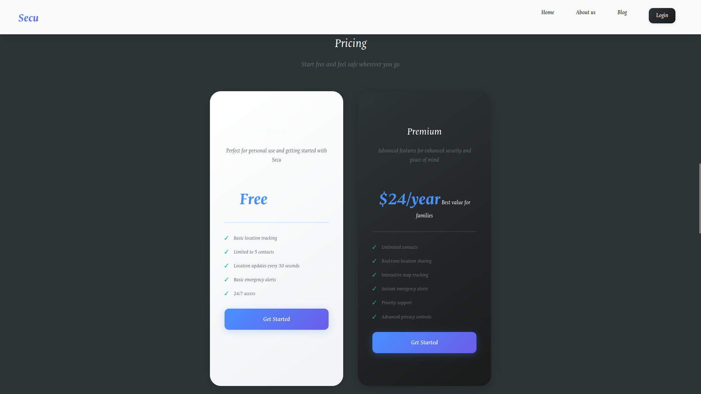
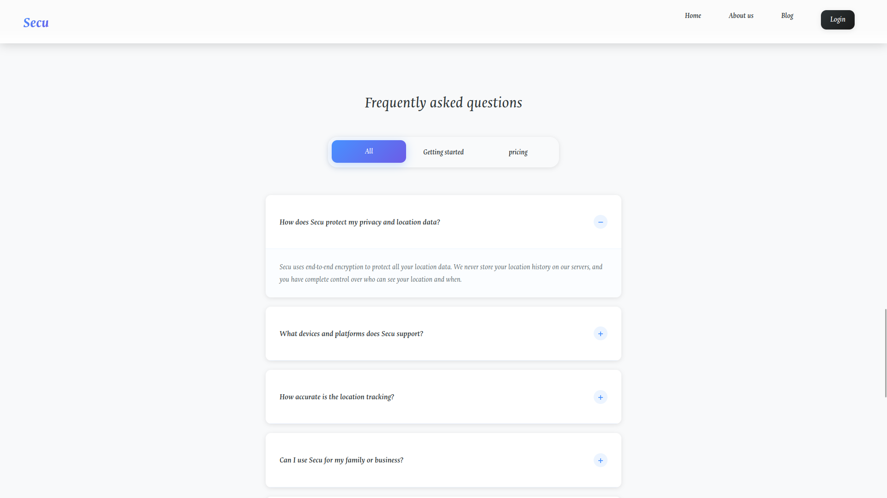
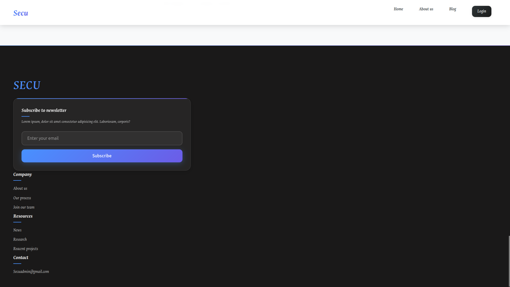

# Web Project

A modern and responsive web project built with HTML, SCSS, and JavaScript.

## 🚀 Description

This project is a demonstration of a modern web development workflow. While it was initially based on a tutorial, it has been significantly modified with custom styles, a conversion to SCSS for more advanced styling, and the integration of AI-powered features. It features a clean and well-structured codebase.

## ✨ Features

*   **Responsive Design**: Adapts to various screen sizes for a seamless experience on any device.
*   **Modern UI/UX**: Clean and intuitive user interface.
*   **SCSS Styling**: Utilizes SASS for more powerful and maintainable CSS.
*   **JavaScript Interactivity**: Dynamic features powered by vanilla JavaScript.

## 🖼️ Screenshots








## 🛠️ Technologies Used

*   **HTML5**: For the structure of the web pages.
*   **SCSS**: For advanced styling and CSS preprocessing.
*   **JavaScript (ES6+)**: For client-side logic and interactivity.
*   **AI Integration**: Incorporates AI-powered features to enhance functionality.

## ⚙️ Getting Started

### Prerequisites

Ensure you have a modern web browser like Chrome, Firefox, or Safari. A live server extension for your code editor is recommended for development.

### Installation

1.  Clone the repository:
    ```bash
    git clone https://your-repository-url.git
    ```
2.  Navigate to the project directory:
    ```bash
    cd Web_exm1
    ```
3.  Open `index.html` in your browser or with a live server.

## Usage

To view the project, simply open the [`index.html`](index.html) file in your web browser. For development, it is recommended to use a live server to automatically see changes.

If you are making changes to the styles, you will need a SASS compiler to convert the `style.scss` file into `style.css`.

## 🤝 Contributing

Contributions are welcome! Please feel free to submit a pull request or open an issue if you have any suggestions or find any bugs.

1.  Fork the Project
2.  Create your Feature Branch (`git checkout -b feature/AmazingFeature`)
3.  Commit your Changes (`git commit -m 'Add some AmazingFeature'`)
4.  Push to the Branch (`git push origin feature/AmazingFeature`)
5.  Open a Pull Request

## 🙏 Acknowledgements

This project was inspired by and built with reference to a tutorial by [Traversy Media](https://www.youtube.com/c/TraversyMedia).
The original tutorial can be found [here](https://www.youtube.com/watch?v=HXYZxVbWkjc).

Significant modifications and additions have been made, including a transition to SCSS, additional styling, and the integration of AI-powered features.

## 📄 License

This project is licensed under the MIT License - see the LICENSE.md file for details.